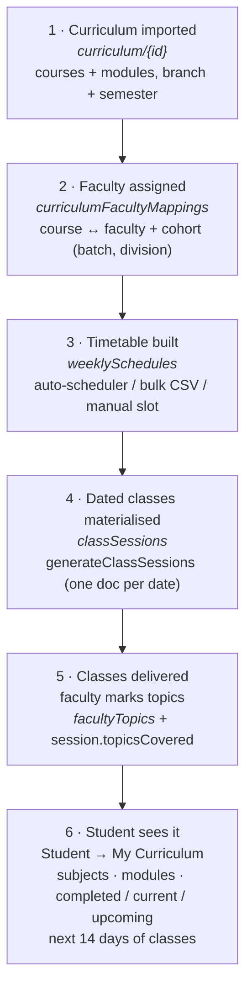

# The one flow: curriculum → faculty → timetable → student

Date: 2026-10-01 · Scope: `curriculum/*` → `curriculumFacultyMappings` →
`weeklySchedules` → `classSessions` (+ `facultyTopics`) → `getMyCurriculum`.

This is the shortest description of how a syllabus becomes "the subjects I am
studying" on a student's phone, and the places where the pieces were wired to
each other with the *same comparison* after the 2026-10-01 fix. For the teaching-
group, merged-class, load-planning and quoted CSV contract, see
[teaching-groups-and-load-planning.md](./teaching-groups-and-load-planning.md).

---

## The flow



Plain-text version of the same flow:

```
 [1] Curriculum ──► [2] Faculty mapping ──► [3] Timetable ──► [4] Dated classes ──► [5] Delivery ──► [6] Student page
 curriculum/{id}   curriculumFaculty-        weeklySchedules     classSessions         facultyTopics      getMyCurriculum
                   Mappings
```

## Stage by stage

| # | Stage | Who does it | Where it is written | Server path |
| --- | --- | --- | --- | --- |
| 1 | Curriculum imported (courses + modules for a branch/semester) | super-admin | `curriculum/*` | `syllabusCurriculumApi` |
| 2 | Faculty assigned to a course **+ cohort** | admin / principal / HOD | `curriculumFacultyMappings` (`status: active`) | Assign Faculty dialog → `createMapping`; Auto Map → `applyAutoMapping` |
| 3 | Weekly timetable built | admin | `weeklySchedules` | `autoGenerateWeeklySchedule` (auto) · `bulkImportWeeklySchedules` (CSV) · `createWeeklySchedule` (manual slot) |
| 4 | Recurring slots → dated classes | admin ("Create dated classes") | `classSessions` | `generateClassSessions` (idempotent per slot + date) |
| 5 | Class taught, topics marked | faculty | session `status/topicsCovered` + `facultyTopics` ledger | `completeClassSession` |
| 6 | Student reads "my curriculum" | student (read-only) | — | `getMyCurriculum` (joins 1–5 for one cohort) |

The student page never reads the collections directly — it asks one callable,
which filters every layer by the student's cohort.

## The field that has to mean the same thing at every hop

A cohort is **branch + batch + semester + division/section**. The same class is
recorded in different shapes by different screens:

| Real meaning | Written as | Rule |
| --- | --- | --- |
| Batch 2027 | `"2027"` (bulk import) / `"2026-2027"`, `"2026-27"` (curriculum dialogs) | an academic-year RANGE is the class of its **END year**; a bare start year (`"2026"`) is a different class |
| Divisions A–D together | `"A,B,C,D"` / `"A B"` / `"Div A, Div B"` | a division field is a **list of letters**; one class covers every letter in it |
| Letter in the other field | `division: ""`, `section: "A"` | division and section are read as one combined set of letters |
| Not recorded | `""` | wildcard on a *row* (covers everybody), "unknown" on a *student* |

## What was missing before 2026-10-01 (and is now fixed)

The student page had been taught these rules, but the scheduling leg still used
literal string comparison — so the flow was broken *upstream* of the student:

| Hop | Before | After |
| --- | --- | --- |
| Auto-scheduler demand (`autoGenerateWeeklySchedule`) | mapping batch `"2026-2027"` did not match a run for `"2027"` → "No active faculty mappings … run Auto Map first" over a full set of mappings | batch tokens compared as keys: range ≡ end year |
| Auto-scheduler demand | mapping division `"A,B,C,D"` did not match a run for division `"A"` — the whole-batch mapping was invisible to every division run | division/section compare as letter sets |
| Occupancy (existing timetable blocks the new one) | cohort identity was the literal string `branch\|batch\|division` — a slot for `2026-2027 / A,B,C,D` did not block a new `2027 / A` class | `cohortScopesOverlap` (batch keys + letter sets) |
| Clash detection (auto-scheduler, bulk import, timetable dialogs) | same literal key: the cohort double-booking warning could not see the class it was double-booking | same `cohortScopesOverlap`, server + browser copies pinned together |

All four now call one shared implementation: `functions/src/cohortBatch.ts`
(server) and `src/shared/utils/cohortMatching.ts` (browser), kept honest by
`functions/test/cohortBatch.test.ts` which imports **both** copies.

Regression guard for the whole chain: `functions/test/curriculumFlow.test.ts`
walks one cohort (BBA, batch 2027, mapped `2026-2027 / A,B,C,D`, divisions A–D)
through demand → timetable row → session → student matcher → clash detection.

## Demo checklist (after merge + `npm run deploy:functions`)

1. Admin → Curriculum → Assign/Auto-Map: a mapping exists for the subject with
   batch `2026-2027` and division `A,B,C,D`.
2. Admin → Class Schedule → Auto-Schedule: batch `2027`, Division `A` →
   preview shows the subject (it used to say "run Auto Map first").
3. Apply → Create dated classes: sessions appear for the cohort.
4. Student (batch 2027, division A) → My Curriculum: subject with modules, and
   the classes in the next 14 days.
5. Faculty completes a class with topics → student's topic moves to
   **Completed** on refresh.

## Known gaps outside this flow (unchanged)

* `bulkImportWeeklySchedules` validates semester 1–10 while the student import
  accepts 1–12 — a semester-11/12 schedule row is rejected as invalid.
* Announcements (`notifications.ts`) and assignments (`studentPortal.ts`) still
  compare the division literally; only the curriculum page, timetable and
  attendance roster read division lists as sets.
* The timetable↔curriculum join is still by subject name/code (a typo creates a
  subject that shows 0 classes against a timetable row that exists).
